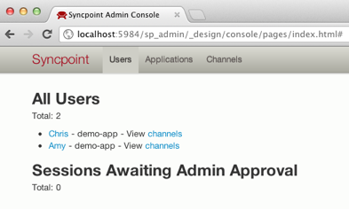

# Syncpoint API

Couchbase Syncpoint is an API suite for synchronizing multi-user interactive applications using Apache CouchDB in the cloud and TouchDB on mobile devices.

## Why Sync?

Realtime is the future of the web. Users have multiple devices, and they want to share on their own terms. Couchbase Syncpoint gives you the flexibility to build your application on top of CouchDB's trusted multi-user replication model.

Syncpoint can be used for things like these: point-of-sale, retail, medical records (doctor with an iPad and limited wifi), military (need that data no matter what), social games. [See these slides from Chicago's WindyCityGo conference for for inspiration of how you might structure an Syncpoint app.](http://dl.dropbox.com/u/14074521/syncpoint-windycity-small.pdf) (Note the OMG POP bragging has nothing to do with Syncpoint, they use Couchbase Server.)

## Millions of users, simplified.

With CouchDB, developers often use per-user database patterns to build sync apps. It works, and folks have success modeling groups, per-user backups, and more complex applications using this model. However, creating and managing all those databases takes code -- code that you don't want to have to write. We've seen what works with CouchSync apps, so we've built Syncpoint to create an easy on-ramp for mobile.

Syncpoint handles user signup, device pairing, and channel management, all with an extensible event-driven `_changes` based API. Syncpoint provisions users, devices, and channels. It's super-easy to hook into the server-side configuration change listeners and write your own event-driven plugins.

If you're building an app that's mostly a JSON API for phones or webpages, you're in the right place. [What do you want to see?](#community)

## Get Started

You need to have three prerequisites. iOS dev chops, Node.js (>=0.6.0) and Apache CouchDB (>=1.2.0). You can get hosted CouchDB free at [IrisCouch](http://www.iriscouch.com) or [Cloudant](http://www.cloudant.com). Once you have your cloud CouchDB url, and you have installed node.js, you can use the Node Package Manager to install Syncpoint:

    npm install syncpoint
    npm start syncpoint

It will prompt you for your cloud URL, and help you set up an admin password. Once it is launched it's time to get into the <a href="https://github.com/couchbaselabs/Syncpoint-iOS">iOS stuff.</a> Or if you want you can continue this adventure by opening the Admin console (your terminal should have printed out the link to the admin console when you ran `npm start syncpoint`);

It may look like this only with zero users:

Once you have compiled the iOS app, pointed at your new Syncpoint node, you see the "Sessions Awaiting Admin Approval" list on your phone or simulator, and you can active it via the admin console.

## Security

The CouchSync document model encourages the notion that each database is an independent security domain. A member of a database can read all the documents, and update them according to application validation logic. It's up to the developer (that's you) to decide who gets access to which channels.

By default Syncpoint keeps each users's full set of devices identical. That means if they install your app on their phone and their tablet, it will have the same data in both places.

It is possible with some server side configuration, to create shared Channels, with multiple users. Users in shared channels see each others updates in real time. They can also continue to query and update data when they are disconnected, so apps stay smooth even on unreliable networks.

For sync applications, your validation logic is run in the Syncpoint cloud, on the users documents as they sync up from the mobile device. By rejecting and invalid updates (can't change doc.author, or whatever your app needs) you can prevent invalid data from being accepted by your servers.

## Channels API

Channels are the unit of sync. A channel is defined by who can access it, and which devices it appears on. If you are subscribed to a channel, you are (generally) able to see all the data in that channel. Since channels are just CouchDB databases, [there's existing documentation about the security model](http://guide.couchdb.org/draft/security.html).

Channels make it easy to keep all of a users devices in sync, and to create apps that bridge multiple users without stressing.

### License

This is under the [Apache 2.0 license](LICENSE)
